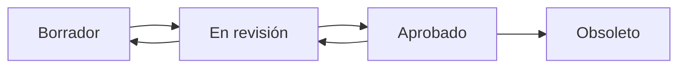

# 00 — Gestión documental y control de la información

## 1. Objetivo

Definir **cómo** se crea, revisa, aprueba, almacena y versiona la documentación del proyecto de tesis y del software Calzatura Vilchez, de modo que sea **auditable** (asesor, ingeniero, jurado) y coherente con buenas prácticas inspiradas en **ISO 9001:2015** (cláusula 7.5 — información documentada) **sin** pretender certificación de la empresa.

## 2. Alcance

Aplica a:

- Toda la carpeta `documentacion/` de la raíz del repositorio.  
- `estado_del_arte.md` (raíz) y su trazabilidad.  
- `calzatura-vilchez/docs/` (legado y BPMN).  
- Evidencias de prueba y CI (referencias por URL/commit, no secretos).

## 3. Tipos de documento

| Tipo | Ejemplos | Formato preferido | Aprobación |
|------|-----------|-------------------|------------|
| **Normativo-interno** | Índice maestro, SRS, plan de pruebas | Markdown en repo | Director / ingeniero |
| **Planificación** | WBS, cronograma, riesgos | MD + CSV Excel | Director |
| **Evidencia** | Actas, capturas, reportes CI | MD + PDF anexo | Quien ejecuta |
| **Académico** | Estado del arte, capítulos | MD / Word universidad | Director |
| **Modelado** | BPMN | `.bpmn` | Ingeniero |

## 4. Identificación y metadatos obligatorios

Cada documento Markdown de esta carpeta debe contener al inicio (plantilla):

```markdown
---
titulo: "<título>"
codigo: "<ej. DOC-05-SRS>"
version: "1.0"
fecha: "YYYY-MM-DD"
autor: "<nombre>"
revisores: "<nombres>"
estado: "borrador | en_revision | aprobado"
---
```

*(Los archivos creados en v1.0 pueden ir incorporando este front-matter progresivamente.)*

## 5. Control de versiones (Git)

- **Rama principal:** la definida por el equipo (`main` / `master`).  
- **Commits:** mensaje en español, verbo en presente (“Añade matriz de riesgos CSV”).  
- **Documentación de release:** etiqueta `docs-vX.Y` opcional al entregar a asesoría.  
- **No commitear:** `.env`, llaves API, tokens, dumps de base de datos con datos personales.

## 6. Ciclo de vida del documento



- **Obsoleto:** solo tras acta o decisión registrada; conservar archivo con marca en cabecera.

## 7. Revisiones formales

Usar `plantillas/PL-01-acta-revision-documento.md` como mínimo para:

- SRS (`05-...`)  
- Plan de pruebas (`08-...`)  
- Documento de arquitectura (`06-...`)  
- Módulo IA (`07-...`)

## 8. Almacenamiento y respaldo

| Activo | Ubicación | Respaldo |
|--------|-----------|----------|
| Documentación técnica | Git remoto (GitHub/GitLab/Bitbucket) | Clon + historial |
| Hojas Excel editadas | Derivadas de `cuadros-excel/*.csv` | Subir PDF exportado a drive institucional **sin** datos sensibles |
| Tesis Word final | Fuera del repo o submódulo | Política universidad |

## 9. Retención y confidencialidad

- Datos de clientes reales: **no** en ejemplos de documentación; usar datos ficticios “PRUEBA_CVxxx”.  
- DNI, direcciones: anonimizar en capturas de tesis.

## 10. Indicadores de calidad documental (KPI internos)

| KPI | Meta sugerida | Medición |
|-----|----------------|----------|
| % requisitos con prueba asociada | ≥ 80 % antes de defensa | `CU-T07` |
| % artículos EDA con fila en trazabilidad | 100 % antes de defensa | `CU-T06` |
| Revisiones formales / semestre | ≥ 2 | Actas en `plantillas/` |

## 11. Registro de cambios de este documento

| Versión | Fecha | Descripción |
|---------|-------|-------------|
| 1.0 | 2026-05-01 | Versión inicial. |
