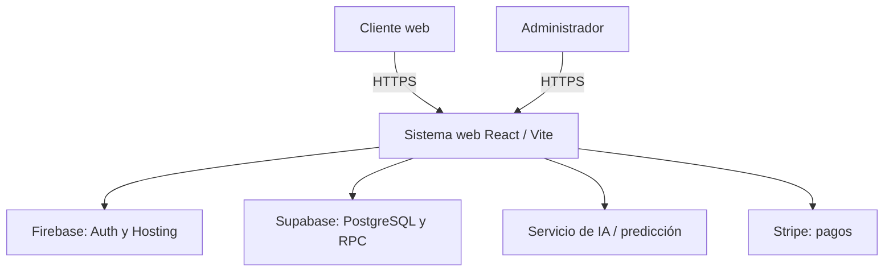

# 01 — Marco del proyecto y alineación con el título de tesis

## 1. Título de tesis (inmutable)

> **Sistema web de comercio electrónico con un modelo de inteligencia artificial para la predicción del riesgo empresarial en la empresa Calzatura Vilchez**

Ningún documento del repositorio debe contradecir este título: los entregables deben demostrar **(A)** comercio electrónico, **(B)** modelo de IA, **(C)** predicción asociada al **riesgo empresarial** en el contexto de **Calzatura Vilchez**.

## 2. Descomposición del título → obligaciones documentales y de producto

| Fragmento del título | Significado operativo | Documentos donde debe quedar explícito | Evidencia típica |
|------------------------|------------------------|----------------------------------------|------------------|
| Sistema **web** | SPA/MPA accesible por navegador | `06`, `09` | URL staging/prod, capturas, Lighthouse opcional |
| **Comercio electrónico** | Catálogo, carrito, pedido, pago o flujo equivalente | `05`, `08`, BPMN | E2E Playwright, manual de usuario |
| **Modelo de inteligencia artificial** | Algoritmo entrenable o inferencia documentada | `07` | Código `ai-service/` o módulo equivalente, versionado de modelo |
| **Predicción** | Salida numérica/clase/intervalo con horizonte definido | `07` | Métricas RMSE, AUC, matriz de confusión, intervalo de confianza |
| **Riesgo empresarial** | Definición del riesgo estudiado (financiero, operativo, demanda, quiebra técnica, etc.) | `01`, `07`, `11` | Variables, hipótesis, límites del modelo |
| **Calzatura Vilchez** | Caso de uso real, datos o proceso empresarial | `01`, entrevistas | Actas, permiso de uso de datos |

## 3. Stakeholders (completar celdas en `cuadros-excel/CU-T01-stakeholders.csv`)

### 3.1 Matriz resumida (plantilla)

| Stakeholder | Interés principal | Poder/Influencia | Riesgo si se ignora | Estrategia |
|-------------|-------------------|------------------|---------------------|------------|
| Dirección Calzatura Vilchez | Rentabilidad, stock | Alta | Desalineación del modelo | Reuniones quincenales |
| Clientes web | Compra confiable | Media | Abandono carrito | UX + confianza (EDA) |
| Asesor doctoral | Rigor científico | Alta | Observaciones tardías | Entregas parciales |
| Ingeniero asesor | ISO, trazabilidad | Alta | No conformidades documentales | Checklist por fase |
| Equipo desarrollo | Claridad requisitos | Media | Deuda técnica | SRS versionado |
| Jurado | Contribución original | Alta | Tesis desaprobada | Matriz trazabilidad |

## 4. Contexto de la empresa (rellenar con datos reales)

### 4.1 Descripción

*(Completar: sector, tamaño, canales actuales, volumen aproximado de ventas, problemática.)*

### 4.2 Problema de investigación

Formulación sugerida (ajustar con director):

- La empresa Calzatura Vilchez enfrenta **incertidumbre** en *(indicadores a definir: rotación, margen, stock, demanda, liquidez…)*.  
- El **comercio electrónico** genera datos que pueden alimentar un **modelo de IA** para **anticipar** situaciones de **riesgo** y apoyar decisiones.

### 4.3 Preguntas de investigación (ejemplo)

1. ¿Qué variables predictivas obtienen mejor desempeño para el riesgo *R* definido?  
2. ¿Cómo integrar la predicción en el sistema web sin comprometer usabilidad y seguridad?  
3. ¿Qué tan generalizable es el modelo con los datos disponibles de la PYME?

## 5. Alcance y exclusiones explícitas

### 5.1 Incluido (IN SCOPE) — alinear con SRS

- Tienda web, autenticación, roles, administración catálogo/stock, ventas, pedidos, reportes acordados.  
- Módulo de **predicción de riesgo** según definición en `07-modulo-ia-riesgo-empresarial.md`.  
- Integración con servicios externos documentados (Stripe, Supabase, Firebase Auth, etc.).

### 5.2 Excluido (OUT OF SCOPE) — declarar para evitar alcance infinito

*(Marcar según realidad: ERP completo, contabilidad general, nómina, logística transportista, app móvil nativa, certificación ISO 9001 de empresa, etc.)*

## 6. Supuestos y dependencias

| ID | Supuesto | Impacto si falla | Mitigación |
|----|----------|------------------|------------|
| AS-01 | Existen datos históricos suficientes | Modelo débil | Plan de datos + simulación |
| AS-02 | Personal clave disponible para validación | Modelo irrelevante | Entrevistas grabadas (consentimiento) |
| AS-03 | Servicios cloud (Supabase/Firebase) operativos | Caída sistema | Monitoreo, página estado |

## 7. Alineación con `estado_del_arte.md`

Los 20 artículos Q1 sustentan principalmente **e-commerce**, confianza, adopción, social commerce, etc. La tesis exige además **IA + riesgo**: debe existir un subconjunto de literatura (capítulo o anexo) y filas dedicadas en `CU-T06-trazabilidad-articulo-requisito.csv` para **riesgo crediticio / early warning / forecasting / ML ops**, según la definición final de riesgo.

## 8. Diagrama de contexto (lógico)

*(Diagrama orientativo; ajustar nombres de servicios según despliegue real.)*

## 9. Registro de cambios

| Versión | Fecha | Descripción |
|---------|-------|-------------|
| 1.0 | 2026-05-01 | Versión inicial. |
