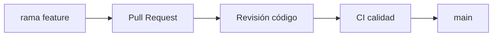

# 04 — Planificación del software (ciclo de vida)

## 1. Objetivo

Describir **cómo** se desarrolla el software del sistema web: entornos, líneas base, criterios de calidad por fase y relación con **ISO/IEC 12207**.

## 2. Entornos

| Entorno | Propósito | Datos | URL / notas |
|---------|-----------|-------|---------------|
| Desarrollo local | Codificación rápida | Prueba / anonimizados | `localhost` |
| Staging / preproducción | Validación integrada | Copia parcial o sintética | *(completar)* |
| Producción | Usuarios reales | Reales con políticas legales | Firebase Hosting + Supabase proyecto prod |

## 3. Líneas base (baselines)

| Línea base | Contenido congelado | Criterio de nueva versión |
|------------|---------------------|---------------------------|
| **BL-REQ-v1** | SRS versión 1.0 | Acta de cambio mayor en alcance |
| **BL-DES-v1** | Arquitectura + modelo datos v1 | Cambio en Supabase que rompe API |
| **BL-IA-v1** | Definición riesgo + features + modelo serializado v1 | Retrain que cambie entradas/salidas |
| **BL-TEST-v1** | Plan de pruebas + casos críticos | Nuevo módulo de pago o auth |

## 4. Flujo de trabajo Git (recomendado)

- Ramas `feature/RF-xxx-descripcion`.  
- PR obligatorio a `main` con checklist: tests, sin secretos, doc actualizada si aplica.

## 5. Gestión de configuración

- **Versionado:** `package.json` versión de app; tag Git por release.  
- **Migraciones Supabase:** orden estricto en `calzatura-vilchez/supabase/migrations/`.  
- **Variables:** solo nombres en documentación; valores en `.env.local` ignorado por Git.

## 6. Gestión de cambios post-baseline

1. Solicitud de cambio (correo o acta breve).  
2. Evaluación impacto (requisitos, diseño, pruebas, tesis).  
3. Aprobación según RACI.  
4. Implementación + pruebas de regresión.  
5. Actualización SRS / matrices CSV.

## 7. Definición de Ready / Done por historia o tarea

### Ready (listo para desarrollar)

- ID de requisito asignado.  
- Criterios de aceptación redactados.  
- Dependencias técnicas resueltas (API, migración).

### Done (terminado)

- Criterios cumplidos + pruebas + sin deuda documental acordada.

## 8. Registro de cambios

| Versión | Fecha | Descripción |
|---------|-------|-------------|
| 1.0 | 2026-05-01 | Versión inicial. |
