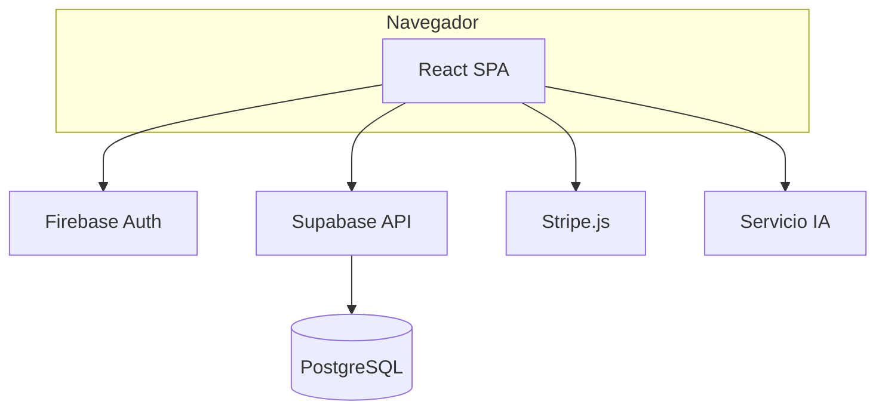

# 06 — Diseño: arquitectura, datos y seguridad

## 1. Vista de arquitectura lógica

### 1.1 Estilo arquitectónico

- **SPA** en React con enrutamiento cliente (`react-router-dom`).  
- **Backend as a service**: Supabase (PostgREST + Auth opcional desactivada si solo Firebase Auth).  
- **Funciones de negocio transaccional** en PostgreSQL (**RPC** + triggers).  
- **IA** como servicio separado (contenedor o cloud) consumido por el front o por edge function *(documentar ruta real)*.

### 1.2 Diagrama de contenedores (texto + Mermaid)

## 2. Descomposición del código (mapa físico)

| Ruta | Dominio | Responsabilidad |
|------|---------|-----------------|
| `src/domains/publico/` | Público | Home, landings, login |
| `src/domains/productos/` | Productos | Catálogo, detalle, admin productos |
| `src/domains/carrito/` | Carrito | Contexto carrito, checkout |
| `src/domains/pedidos/` | Pedidos | Creación, historial, admin |
| `src/domains/clientes/` | Clientes | Favoritos |
| `src/domains/ventas/` | Ventas | Ventas diarias, finanzas, admin |
| `src/domains/administradores/` | Admin | AdminData, predicciones, etc. |
| `src/domains/usuarios/` | Usuarios | Auth context, perfiles |
| `src/domains/fabricantes/` | Fabricantes | CRUD fabricantes |
| `src/supabase/client.ts` | Infra | Cliente Supabase |
| `src/firebase/config.ts` | Infra | Firebase app + auth |

## 3. Modelo de datos (Supabase)

### 3.1 Tablas principales (derivado de migraciones)

| Tabla | Propósito |
|-------|-----------|
| `productos` | Catálogo, stock, taxonomía comercial, `familiaId`, `campana`, flags importación |
| `productoCodigos` | Código único por producto + `actualizadoEn` |
| `productoFinanzas` | Márgenes y precios sugeridos |
| `pedidos` | Órdenes de compra |
| `usuarios` | Perfil extendido y rol |
| `favoritos` | Relación usuario–producto |
| `ventasDiarias` | Movimientos de venta |
| `fabricantes` | Proveedores |
| `auditoria` | Registro de acciones admin |

### 3.2 RPC críticos

| Función | Uso |
|---------|-----|
| `create_product_variants_atomic` | Creación atómica de variantes + código + finanzas |
| `update_product_atomic` | Actualización atómica producto + código + finanzas |

### 3.3 Integridad y reglas en BD

- **CHECK** categoría, descuento, precio positivo (`20260502020000_add_commercial_guardrails.sql`).  
- **Triggers** coherencia categoría–tipoCalzado–estilo–material.  
- **Índice único** códigos CI (`20260501135500_enforce_unique_product_codes.sql`).

## 4. Seguridad de diseño

### 4.1 Amenazas (STRIDE resumido)

| Amenaza | Mitigación en diseño |
|---------|----------------------|
| Suplantación | Firebase Auth + control de rol en UI y datos |
| Manipulación de datos | RPC/triggers; validación servidor |
| Repudio | `auditoria` + timestamps |
| Divulgación | HTTPS, no secretos en cliente |
| Denegación de servicio | Rate limit Supabase/Firewall *(completar si aplica)* |
| Elevación de privilegio | Roles en `usuarios`, rutas protegidas |

### 4.2 Datos personales

- Minimización: solo campos necesarios en `usuarios` y pedidos.  
- Acceso: políticas según configuración Supabase (**documentar si RLS está activo**).

## 5. Interfaces de usuario (navegación)

- Mapa de rutas: derivar de `src/routes` o equivalente y adjuntar diagrama en anexo de tesis.  
- Guías de estilo: referencia `src/index.css` (gran hoja; para tesis puede resumirse tipografía/colores en tabla).

## 6. Diseño del módulo IA (referencia)

Detalle algorítmico en `07-modulo-ia-riesgo-empresarial.md`; aquí solo interfaces: endpoints, payloads, códigos error.

## 7. Decisiones de arquitectura (ADR — plantilla)

| ID | Decisión | Alternativas | Estado | Fecha |
|----|----------|--------------|--------|-------|
| ADR-001 | Supabase como BD principal | Firestore | Aprobado | *(fecha)* |
| ADR-002 | Firebase solo Auth+Hosting | Auth Supabase | Aprobado | *(fecha)* |

*(Añadir filas en tabla o archivo `adr/` opcional.)*

## 8. Historial de versiones

| Versión | Fecha | Descripción |
|---------|-------|-------------|
| 1.0 | 2026-05-01 | Versión inicial. |
