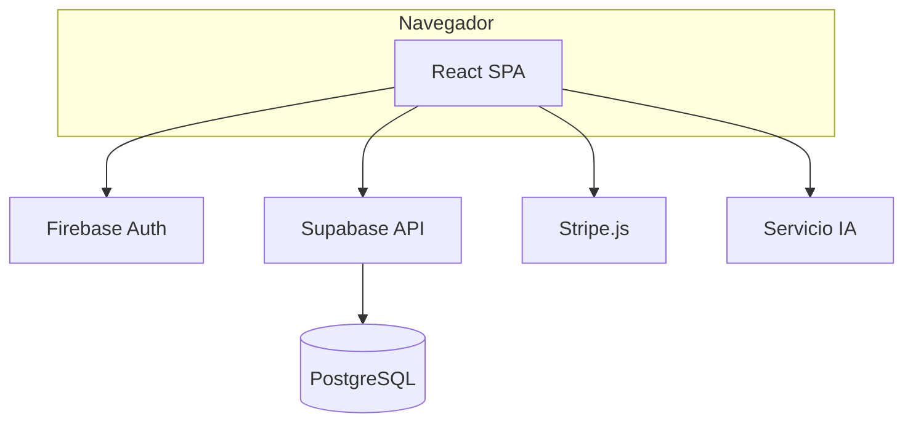

# 06 — Diseño: arquitectura, datos y seguridad

## 1. Vista de arquitectura lógica

### 1.1 Estilo arquitectónico

- **SPA** en React con enrutamiento cliente (`react-router-dom`).  
- **Backend as a service**: Supabase (PostgREST + Auth opcional desactivada si solo Firebase Auth).  
- **Funciones de negocio transaccional** en PostgreSQL (**RPC** + triggers).  
- **IA** como servicio separado (contenedor o cloud) consumido por el front o por edge function *(documentar ruta real)*.

### 1.2 Diagrama de contenedores (texto + Mermaid)

## 2. Descomposición del código (mapa físico)

### 2.1 Dominios (`src/domains/`)

| Ruta | Estado | Responsabilidad |
|------|--------|-----------------|
| `src/domains/publico/` | Implementado | Home, landings (CyberWow, Club Calzado), login, registro, verificación de email, páginas informativas |
| `src/domains/productos/` | Implementado | Catálogo, detalle, admin productos, variantes, familias |
| `src/domains/carrito/` | Implementado | Contexto carrito, checkout |
| `src/domains/pedidos/` | Implementado | Creación, historial, admin |
| `src/domains/clientes/` | Implementado | Favoritos |
| `src/domains/ventas/` | Implementado | Ventas diarias, finanzas, admin |
| `src/domains/administradores/` | Implementado | AdminData, predicciones IA, auditoría, campañas |
| `src/domains/usuarios/` | Implementado | Auth context, perfiles |
| `src/domains/fabricantes/` | Implementado | CRUD fabricantes |
| `src/domains/trabajadores/` | **Sin implementar** | Reservado para gestión de trabajadores — directorio presente pero vacío; fuera del alcance actual |

### 2.2 Infraestructura transversal

| Ruta | Responsabilidad |
|------|-----------------|
| `src/supabase/client.ts` | Cliente Supabase (PostgREST + Realtime) |
| `src/firebase/config.ts` | Firebase app + auth |
| `src/services/aiAdminClient.ts` | Cliente HTTP hacia el servicio IA con autenticación Firebase ID token |
| `src/hooks/useProductsRealtime.ts` | Supabase Realtime — recarga productos, códigos y finanzas con debounce 300 ms |
| `src/hooks/useFavoritesRealtime.ts` | Supabase Realtime — recarga favoritos del usuario |
| `src/hooks/useOrdersRealtime.ts` | Supabase Realtime — recarga pedidos en tiempo real |
| `src/hooks/useThemeMode.ts` | Modo claro/oscuro persistido en localStorage |
| `src/utils/` | 12 utilidades: stock, colores, email, familias, importación, imágenes, etc. |
| `src/security/accessControl.ts` | Lógica de control de acceso por rol |

## 3. Modelo de datos (Supabase)

### 3.1 Tablas principales (derivado de 27 migraciones)

| Tabla | Propósito |
|-------|-----------|
| `productos` | Catálogo, stock, taxonomía comercial, `familiaId`, `campana`, flags importación |
| `productoCodigos` | Código único por producto + `actualizadoEn` |
| `productoFinanzas` | Márgenes y precios sugeridos |
| `pedidos` | Órdenes de compra con `pagadoEn`, `canal` y `stripeSessionId` |
| `usuarios` | Perfil extendido y rol (`admin`, `trabajador`, `cliente`) |
| `favoritos` | Relación usuario–producto (Supabase Realtime habilitado) |
| `ventasDiarias` | Movimientos de venta por canal (`tienda` / `web`) |
| `fabricantes` | Proveedores con hash de DNI protegido |
| `auditoria` | Registro de acciones admin con retención de 2 años |
| `ireHistorial` | Historial longitudinal del IRE: score, nivel, dimensiones, versión, fórmula, variables, detalle |
| `modeloEstado` | Estado del modelo IA persistido entre reinicios (training_meta, data_hash) |
| `campanas_detectadas` | Campañas comerciales detectadas automáticamente por el modelo IA |
| `campana_productos` | Productos asociados a cada campaña con `impacto_soles` estimado |
| `campana_metricas_diarias` | Métricas diarias de desempeño por campaña |
| `campana_feedback` | Feedback del administrador sobre campañas detectadas (confirmar/rechazar) |

### 3.2 RPC críticos

| Función | Uso |
|---------|-----|
| `create_product_variants_atomic` | Creación atómica de variantes + código + finanzas |
| `update_product_atomic` | Actualización atómica producto + código + finanzas |

### 3.3 Integridad y reglas en BD

- **CHECK** categoría, descuento, precio positivo (`20260502020000_add_commercial_guardrails.sql`).  
- **Triggers** coherencia categoría–tipoCalzado–estilo–material.  
- **Índice único** códigos CI (`20260501135500_enforce_unique_product_codes.sql`).

## 4. Seguridad de diseño

### 4.1 Amenazas (STRIDE resumido)

| Amenaza | Mitigación en diseño |
|---------|----------------------|
| Suplantación | Firebase Auth en UI + `firebase_verifier.py` en el servicio IA (verifica Firebase ID token sin service account, solo con `FIREBASE_PROJECT_ID`) |
| Manipulación de datos | RPC/triggers PostgreSQL; validación servidor; CHECK constraints |
| Repudio | Tabla `auditoria` + timestamps; trigger `trg_audit_pedido_insert` |
| Divulgación | HTTPS en todos los servicios; secretos solo en variables de entorno; `VITE_AI_SERVICE_BEARER_TOKEN` bloqueado en build por guard en `vite.config.ts` |
| Denegación de servicio | `slowapi` (rate limiting por IP) en el servicio IA FastAPI |
| Elevación de privilegio | Roles en `usuarios`; rutas protegidas por `accessControl.ts`; `SUPERADMIN_EMAILS` verificado en cada request al servicio IA |

### 4.2 Datos personales

- Minimización: solo campos necesarios en `usuarios` y pedidos.  
- Acceso: políticas según configuración Supabase (**documentar si RLS está activo**).

## 5. Interfaces de usuario (navegación)

- Mapa de rutas: derivar de `src/routes` o equivalente y adjuntar diagrama en anexo de tesis.  
- Guías de estilo: referencia `src/index.css` (gran hoja; para tesis puede resumirse tipografía/colores en tabla).

## 6. Diseño del módulo IA (referencia)

Detalle algorítmico en `07-modulo-ia-riesgo-empresarial.md`; aquí solo interfaces: endpoints, payloads, códigos error.

## 7. Decisiones de arquitectura (ADR — plantilla)

| ID | Decisión | Alternativas | Estado | Fecha |
|----|----------|--------------|--------|-------|
| ADR-001 | Supabase como BD principal | Firestore | Aprobado | *(fecha)* |
| ADR-002 | Firebase solo Auth+Hosting | Auth Supabase | Aprobado | *(fecha)* |

*(Añadir filas en tabla o archivo `adr/` opcional.)*

## 8. Historial de versiones

| Versión | Fecha | Descripción |
|---------|-------|-------------|
| 1.0 | 2026-05-01 | Versión inicial. |
