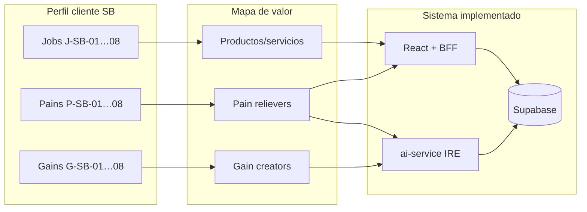

# Matriz de Propuesta de Valor del Proyecto — Calzatura Vilchez

**Proyecto / tesis:** Sistema web de comercio electrónico con un modelo de inteligencia artificial para la predicción del riesgo empresarial en la empresa Calzatura Vilchez  
**Metodología base:** *Value Proposition Canvas* (Osterwalder, Pigneur, Bernarda & Smith, 2014) + matriz de encaje producto–cliente  
**Versión:** 1.0 · **Fecha:** 2026-06-19  
**Word:** `Matriz_Propuesta_Valor_Calzatura_Vilchez.docx` (raíz del repo) · copia en `documentacion/`  
**Regenerar Word:** `python scripts/generar_matriz_propuesta_valor.py`  
**Cuadro Excel:** `cuadros-excel/CU-T12-matriz-propuesta-valor.csv`  
**Fuentes internas:** `formato-09-alcance-proyecto-software.md`, `07-modulo-ia-riesgo-empresarial.md`, `CU-T05-requisitos.csv`, SRS v1.0

---

## 1. Fundamento metodológico

### 1.1 Qué es y para qué sirve

La **propuesta de valor** es la promesa explícita de beneficios que el sistema entrega a cada segmento de usuario, alineada con sus **trabajos** (*jobs to be done*), **frustraciones** (*pains*) y **beneficios esperados** (*gains*) (Osterwalder et al., 2014). No describe solo funciones técnicas: explica **por qué** el producto resuelve un problema real mejor que la situación actual (registros manuales, Excel disperso, venta solo presencial).

En proyectos de tesis de software, la matriz cumple tres roles:

1. **Justificación de negocio** — vincula el título (e-commerce + IA + riesgo) con necesidades empresariales verificables.  
2. **Trazabilidad de diseño** — cada aliviador de dolor y creador de beneficio se mapea a RF/RNF implementados.  
3. **Defensa ante jurado** — demuestra *problem–solution fit* antes de hablar de ISO 25000 o estado del arte.

### 1.2 Estructura del instrumento (dos bloques + matriz de encaje)

| Bloque | Componentes | Pregunta guía |
|--------|-------------|---------------|
| **Perfil del cliente** | Jobs · Pains · Gains | ¿Qué intenta lograr el usuario y qué le frustra hoy? |
| **Mapa de valor** | Productos/servicios · Pain relievers · Gain creators | ¿Cómo el sistema alivia dolores y genera beneficios? |
| **Encaje (fit)** | Matriz fila a fila | ¿Cada dolor prioritario tiene respuesta verificable en producto? |

Referencia metodológica: [Strategyzer — Value Proposition Canvas](https://www.strategyzer.com/library/the-value-proposition-canvas).

### 1.3 Segmentos considerados

| ID | Segmento | Stakeholder (CU-T01) | Prioridad | Justificación |
|----|----------|----------------------|-----------|---------------|
| **SA** | Cliente web | STK-02 | Alta | Genera datos de demanda y valida e-commerce |
| **SB** | Administrador / Dirección | STK-01 | **Crítica** | Usuario del IRE, inventario y decisiones operativas |
| **SC** | Visitante | — (previo a STK-02) | Media | Embudo de conversión y descubrimiento de catálogo |

> El segmento **SB** concentra la propuesta de valor diferencial (IA + IRE). SA y SC completan el ecosistema comercial que alimenta datos al modelo.

---

## 2. Propuesta de valor global (enunciado síntesis)

> **Para** la dirección y el equipo administrativo de Calzatura Vilchez (PYME retail calzado, Huancayo), **que** enfrentan quiebres de stock, ventas no digitalizadas e imposibilidad de anticipar presión comercial-operativa, **nuestro sistema** es una **plataforma web integrada de e-commerce con inteligencia artificial** que **centraliza catálogo, pedidos, inventario y analítica**, **calcula y proyecta el Índice de Riesgo Empresarial (IRE)** y **alerta antes de que el riesgo se materialice en pérdidas**, **a diferencia de** hojas de cálculo, registros manuales y venta exclusivamente presencial, **porque** unifica datos en Supabase, expone predicción Random Forest con trazabilidad documentada y cumple requisitos legales peruanos de comercio electrónico.

---

## 3. Segmento SB — Administrador / Dirección (núcleo del proyecto)

### 3.1 Perfil del cliente

#### Jobs to be done (trabajos a realizar)

| ID | Job | Situación actual (sin sistema) |
|----|-----|--------------------------------|
| J-SB-01 | Publicar y mantener catálogo de calzado con tallas, colores e imágenes | Catálogo físico / WhatsApp / fotos sueltas |
| J-SB-02 | Controlar stock por variante y evitar vender lo inexistente | Conteo manual, errores entre tienda y depósito |
| J-SB-03 | Registrar ventas presenciales y online en un solo lugar | Libretas, Excel no sincronizado |
| J-SB-04 | Gestionar pedidos, pagos y estados de entrega | Llamadas, papel, seguimiento ad hoc |
| J-SB-05 | Conocer rentabilidad por producto (costo, margen) | Cálculos esporádicos, sin dashboard |
| J-SB-06 | **Anticipar quiebre de stock y caída de ingresos** | Reacción tardía cuando ya faltó producto |
| J-SB-07 | **Monitorear riesgo comercial-operativo con un indicador único** | Intuición gerencial sin métrica formal |
| J-SB-08 | Cumplir obligaciones legales (reclamaciones, privacidad) | Riesgo de incumplimiento Ley 29571 / 29733 |

#### Pains (frustraciones)

| ID | Pain | Severidad | Evidencia contextual |
|----|------|-----------|----------------------|
| P-SB-01 | Quiebre de stock en productos de alta rotación | Alta | Formato 09 § problema |
| P-SB-02 | Capital inmovilizado en productos de baja rotación | Alta | Análisis ABC requerido |
| P-SB-03 | Pérdida de ventas online por información desactualizada | Alta | Checkout con catálogo vivo |
| P-SB-04 | Datos dispersos (ventas, pedidos, inventario) | Alta | Motivación central Formato 09 |
| P-SB-05 | Decisiones de reabastecimiento sin pronóstico | Alta | Objetivo IA Formato 09 |
| P-SB-06 | Sin visibilidad de riesgo agregado del negocio | **Crítica** | Título de tesis / IRE |
| P-SB-07 | Tiempo excesivo en tareas administrativas repetitivas | Media | Digitalización retail |
| P-SB-08 | Incertidumbre legal en e-commerce | Media | RF-LEG-01…04 |

#### Gains (beneficios esperados)

| ID | Gain | Tipo |
|----|------|------|
| G-SB-01 | Un solo panel con KPIs de ventas, pedidos y productos | Esperado |
| G-SB-02 | Alertas de stock con **fecha estimada de quiebre** | Esperado |
| G-SB-03 | **IRE 0–100** con clasificación Bajo/Moderado/Alto/Crítico | Deseado |
| G-SB-04 | Proyección de IRE a 7/15/30 días | Deseado |
| G-SB-05 | Ranking de productos y recomendaciones automáticas | Deseado |
| G-SB-06 | Reducción de errores en precios y totales | Esperado |
| G-SB-07 | Trazabilidad de pedidos y auditoría admin | Requerido |
| G-SB-08 | Confianza en cumplimiento normativo peruano | Requerido |

### 3.2 Mapa de valor (solución)

#### Productos y servicios

| Componente | Descripción | RF / IN |
|------------|-------------|---------|
| Panel administrativo | Dashboard indicadores negocio | RF-ADM-01, IN-14 |
| Gestión catálogo/stock | CRUD productos, talla/color, imágenes Cloudinary | RF-ADM-02/03, IN-15/16/17 |
| Ventas y finanzas | Ventas diarias, márgenes, documentos | RF-ADM-06/08, IN-19/21/22 |
| Pedidos admin | Cambio de estados, historial | RF-ADM-07, IN-20 |
| **Módulo IA** | Predicción demanda, IRE, alertas, ABC | RF-IA-01…04, IN-26…36 |
| Cumplimiento legal | Libro reclamaciones, privacidad, cookies, términos | RF-LEG-01…04 |

#### Pain relievers (aliviadores de frustración)

| Pain | Pain reliever | Evidencia implementada |
|------|---------------|------------------------|
| P-SB-01 | Alertas stock + fecha quiebre + análisis ABC | `AdminPredictionsDashboard`, IN-27, IN-34 |
| P-SB-02 | Capital inmovilizado e ingresos en riesgo calculados | IN-35, ai-service |
| P-SB-03 | Stock y precios validados server-side (BFF + triggers) | RF-RN-01/02, `precisionBffGuards` |
| P-SB-04 | Supabase PostgreSQL único: ventas, pedidos, productos, IRE histórico | `ireHistorial`, migraciones |
| P-SB-05 | RandomForestRegressor + fallback conservador | `ai-service/`, RF-IA-02 |
| P-SB-06 | **IRE compuesto** (40% stock + 35% ingresos + 25% demanda) | `07-modulo-ia`, RF-IA-01 |
| P-SB-07 | Automatización CRUD, import Excel, RPC atómicos | RF-ADM-*, RF-RN-02 |
| P-SB-08 | Páginas legales + TC-CMP E2E | RF-LEG-*, `verify-cumplimiento` |

#### Gain creators (creadores de beneficio)

| Gain | Gain creator | Evidencia |
|------|--------------|-----------|
| G-SB-01 | Dashboard admin con KPIs en tiempo real | RF-ADM-01, capturas dashboard |
| G-SB-02 | Motor alertas con horizonte configurable | RF-IA-03, IN-27 |
| G-SB-03 | Score IRE con niveles y contribuciones por variable | Panel IRE, tests invariantes |
| G-SB-04 | IRE proyectado descontando consumo estimado | IN-32, API `/api/predict/combined` |
| G-SB-05 | Top vendidos + baja rotación por período | IN-36 |
| G-SB-06 | Guards BFF totales/precios; reglas comerciales BD | `verify-precision` |
| G-SB-07 | Auditoría admin, PKCS#7 pedidos, RLS | RF-SEG, Seguridad checklist |
| G-SB-08 | Ley 29571/29733 implementada | TC-CMP-001…004 |

### 3.3 Encaje SB — veredicto

| Criterio | Estado |
|----------|--------|
| Jobs prioritarios cubiertos | ✅ 8/8 |
| Pains críticos/altos con pain reliever | ✅ 8/8 |
| Gains deseados con gain creator | ✅ 8/8 |
| Trazabilidad RF Must | ✅ CU-T05 |
| Evidencia automatizada | ✅ Gates idoneidad, precisión, cumplimiento |

**Encaje producto–valor SB:** ✅ **Logrado** (problem–solution fit documentado e implementado).

---

## 4. Segmento SA — Cliente web

### 4.1 Perfil del cliente (resumen)

| Jobs | Pains | Gains |
|------|-------|-------|
| J-SA-01 Descubrir calzado por categoría/marca | P-SA-01 No encontrar talla/color disponible | G-SA-01 Catálogo claro con filtros |
| J-SA-02 Comprar online con confianza | P-SA-02 Desconfianza en pago/datos personales | G-SA-02 Checkout seguro Stripe + COD |
| J-SA-03 Registrarse y gestionar perfil | P-SA-03 Registro tedioso o inválido | G-SA-03 Registro con validación DNI |
| J-SA-04 Seguir pedido y repetir compra | P-SA-04 Sin historial ni favoritos | G-SA-04 Historial pedidos y favoritos |
| J-SA-05 Comprar desde móvil | P-SA-05 Web no usable en celular | G-SA-05 UI responsive / app Flutter |

### 4.2 Mapa de valor SA

| Pain / Gain | Respuesta del sistema | RF |
|-------------|----------------------|-----|
| P-SA-01 | Ficha producto con stock talla/color en vivo | RF-CAT-02 |
| P-SA-02 | Stripe + políticas legales + HTTPS/App Check | RF-PAG-01, RF-LEG-* |
| P-SA-03 | Registro Firebase + lookup DNI APISPERU | RF-AUT-01 |
| P-SA-04 | Historial pedidos, favoritos | RF-PED-03, RF-FAV-01 |
| P-SA-05 | Tailwind responsive, E2E móvil | RNF-USA, idoneidad-journey |

**Encaje SA:** ✅ Logrado para jobs comerciales core; sesión SUS formal pendiente (Usabilidad 70% en ítem cumplimiento).

---

## 5. Segmento SC — Visitante

| Job | Pain | Propuesta | RF |
|-----|------|-----------|-----|
| J-SC-01 Explorar catálogo sin registrarse | P-SC-01 Información pobre o lenta | Home, categorías, destacados, lazy loading | RF-CAT-01 |
| J-SC-02 Conocer tienda y políticas | P-SC-02 Falta transparencia | Páginas info, FAQ, términos | RF-LEG-* |

**Encaje SC:** ✅ Logrado.

---

## 6. Matriz consolidada de encaje (VPC → sistema)

La tabla completa exportable está en **`CU-T12-matriz-propuesta-valor.csv`**. Resumen de columnas:

| Columna | Descripción |
|---------|-------------|
| `Segmento` | SA / SB / SC |
| `Tipo_VPC` | Job · Pain · Gain · Producto · Pain_Reliever · Gain_Creator |
| `ID_elemento` | Identificador único (ej. P-SB-06) |
| `Descripcion` | Enunciado en lenguaje de negocio |
| `Componente_sistema` | Módulo o pantalla |
| `Req_ID` | RF/RNF trazable |
| `Evidencia_repo` | Gate, E2E, doc |
| `Articulo_Q1` | Respaldo estado del arte |
| `DOI` | Enlace verificado |
| `Encaje` | Logrado · Parcial · Pendiente |

### 6.1 Diferenciadores frente a alternativas

| Alternativa | Limitación | Ventaja Calzatura Vilchez |
|-------------|------------|---------------------------|
| Venta solo presencial | Sin datos online ni escala geográfica | E-commerce + app móvil |
| Excel / cuaderno | Sin tiempo real ni integración pagos | Supabase + Stripe + BFF |
| E-commerce genérico (Shopify, etc.) | Sin IRE ni predicción demanda calzado | IRE + RF calzado + analítica ABC |
| ERP contable completo | Sobredimensionado para PYME; fuera alcance | Enfoque retail calzado + IA acotada |

### 6.2 Indicadores de éxito de la propuesta de valor (alineados CU-T09)

| Propuesta | Indicador de validación | Instrumento |
|-----------|-------------------------|-------------|
| Digitalización ventas/inventario | % procesos digitalizados O₁→O₂ | Encuesta Likert + logs Supabase |
| Precisión predicción | MAE/RMSE RF vs baseline | `ai-service/evaluate.py` |
| Anticipación de riesgo | IRE medio, quiebres stock O₁→O₂ | `ireHistorial`, conteo quiebres |
| Confianza cliente | Conversión checkout, abandono carrito | Analytics / E2E |
| Cumplimiento legal | Checklist TC-CMP | `verify-cumplimiento` |

---

## 7. Respaldo bibliográfico Q1 (por dimensión de valor)

| Dimensión valor | Artículo Q1 (verificado) | DOI | Qué respalda |
|-----------------|--------------------------|-----|--------------|
| Transformación digital PYME | Verhoef et al. (2019) — *Digital transformation: A multidisciplinary reflection* | [10.1016/j.jbusres.2019.09.022](https://doi.org/10.1016/j.jbusres.2019.09.022) | Contexto digitalización Calzatura Vilchez |
| Retail / cadena valor | Reinartz et al. (2019) — *The impact of digital transformation on the retailing value chain* | [10.1016/j.ijresmar.2018.12.002](https://doi.org/10.1016/j.ijresmar.2018.12.002) | Jobs J-SB-01…04, omnicanal |
| E-commerce + IA + PYME | Dai et al. (2024) — *Revolutionizing cross-border e-commerce…* | [10.1371/journal.pone.0305639](https://doi.org/10.1371/journal.pone.0305639) | Propuesta global integrada |
| IA para decisiones | Duan et al. (2019) — *Artificial intelligence for decision making in the era of Big Data* | [10.1016/j.ijinfomgt.2019.01.021](https://doi.org/10.1016/j.ijinfomgt.2019.01.021) | IRE y panel predicciones |
| Big data operaciones | Choi et al. (2018) — *Big data analytics in operations management* | [10.1111/poms.12838](https://doi.org/10.1111/poms.12838) | Stock, demanda, KPIs |
| E-SQ moda/calzado | Gutiérrez-Rodríguez et al. (2020) — *E-SQ, E-Satisfaction and E-Loyalty for fashion E-Retailers* | [10.1016/j.jretconser.2020.102201](https://doi.org/10.1016/j.jretconser.2020.102201) | Segmento SA — calidad servicio |
| Pronóstico / precisión | Makridakis et al. (2018) — *Statistical and ML forecasting methods* | [10.1371/journal.pone.0194889](https://doi.org/10.1371/journal.pone.0194889) | Pain P-SB-05, gain predicción |
| Retail forecasting | Fildes et al. (2019) — *Retail forecasting: Research and practice* | [10.1016/j.ijforecast.2019.06.004](https://doi.org/10.1016/j.ijforecast.2019.06.004) | Demanda calzado |
| Prescriptive analytics | Lepenioti et al. (2020) — *Prescriptive analytics: Literature review* | [10.1016/j.ijinfomgt.2019.04.003](https://doi.org/10.1016/j.ijinfomgt.2019.04.003) | Alertas y recomendaciones admin |

---

## 8. Diagrama de encaje (mermaid)



---

## 9. Limitaciones y hipótesis (honestidad académica)

| Aspecto | Limitación | Mitigación documentada |
|---------|------------|------------------------|
| IRE vs quiebra financiera | IRE = riesgo **comercial-operativo**, no Altman | `07-modulo-ia` §1 |
| Validación O₁→O₂ | Mediciones pre/post requieren operación sostenida | CU-T09, encuesta Likert |
| App móvil iOS | Flutter Android verificado; IPA iOS parcial | Portabilidad 71% adaptabilidad |
| CU-T06 trazabilidad EDA | CSV desactualizado | Usar esta matriz + estado del arte 43 |

---

## 10. Referencias metodológicas

- Osterwalder, A., Pigneur, Y., Bernarda, G., & Smith, A. (2014). *Value Proposition Design*. Wiley / Strategyzer.  
- Strategyzer (2026). *The Value Proposition Canvas*. https://www.strategyzer.com/library/the-value-proposition-canvas  
- Osterwalder, A., & Pigneur, Y. (2010). *Business Model Generation*. Wiley.  
- Christensen, C. M., Hall, T., Dillon, K., & Duncan, D. S. (2016). Know your customers’ “jobs to be done”. *Harvard Business Review*.

---

## 11. Control de versiones

| Versión | Fecha | Cambio |
|---------|-------|--------|
| 1.0 | 2026-06-19 | Creación matriz VPC + CU-T12 |

---

## 12. Comandos de verificación cruzada

```powershell
# Requisitos que sustentan la propuesta de valor
type documentacion\cuadros-excel\CU-T05-requisitos.csv

# Consistencia problema–objetivo–hipótesis
type documentacion\cuadros-excel\CU-T09-matriz-consistencia.csv

# Gates funcionalidad core
node scripts/verify-idoneidad-iso25000.mjs
node scripts/verify-cumplimiento-iso25000.mjs
```
