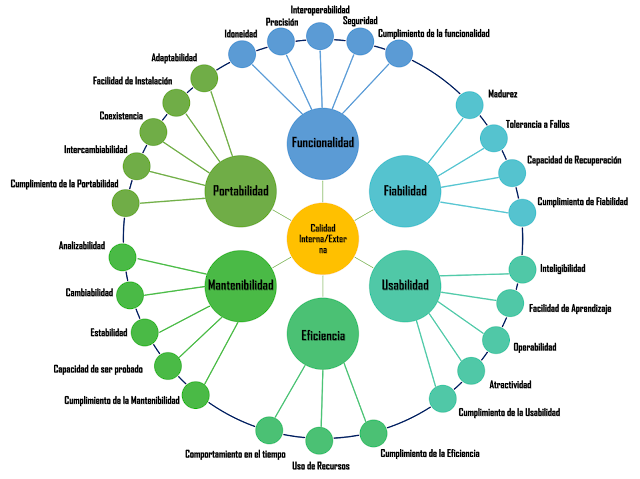

# Modelo de calidad del producto — ISO/IEC 25000 (SQuaRE)

**Proyecto:** Calzatura Vilchez · Tesis UCV  
**Autor:** Piero Vilchez  
**Última revisión:** junio 2026

---

## 1. Propósito

Este documento fija el **marco normativo y la taxonomía** usados en la tesis y en el dashboard de cumplimiento (`dashboard-iso25000/`).  
No redefine el enfoque de la investigación: la evaluación de calidad del software se enmarca en la **familia ISO/IEC 25000 (SQuaRE)** y se operacionaliza con el **modelo de calidad interna/externa de seis características** del diagrama de referencia del proyecto.

---

## 2. Marco normativo — ISO/IEC 25000 (SQuaRE)

| Norma | Rol en la tesis |
|-------|-----------------|
| **ISO/IEC 25000** | Familia **SQuaRE** (*Software product Quality Requirements and Evaluation*): marco general de requisitos y evaluación de calidad del producto software. |
| **ISO/IEC 9126-1:2001** | Modelo de **calidad interna / calidad externa** con **6 características** y **27 subcaracterísticas** — taxonomía **operativa** del dashboard y de las listas de cotejo. |
| **ISO/IEC 25010:2011** | Evolución posterior del modelo de producto (8 características). Se cita solo como **referencia cruzada técnica**; **no** estructura el capítulo ni la UI de la tesis. |
| **ISO/IEC 25023** | Medidas de calidad del producto (p. ej. portabilidad FAd/FIn/FRe). Complemento para evidencias numéricas. |

**Redacción sugerida para la tesis:**

> *La evaluación de la calidad del producto software se enmarca en la familia **ISO/IEC 25000 (SQuaRE)**. Las características evaluadas siguen el modelo de **calidad interna y externa** con seis dimensiones (Funcionalidad, Fiabilidad, Usabilidad, Eficiencia, Mantenibilidad y Portabilidad) y veintisiete subcaracterísticas, conforme al diagrama de referencia del estudio y a ISO/IEC 9126-1.*

---

## 3. Diagrama de referencia (modelo aplicado)



**Lectura del diagrama (sentido horario, desde arriba):**

| Posición | Característica | N.° subcaracterísticas |
|----------|----------------|------------------------|
| 12 h | **Funcionalidad** | 5 |
| 2 h | **Fiabilidad** | 4 |
| 4 h | **Usabilidad** | 5 |
| 6 h | **Eficiencia** | 3 |
| 8 h | **Mantenibilidad** | 5 |
| 10 h | **Portabilidad** | 5 |

**Núcleo central:** *Calidad interna / Calidad externa* — el software se evalúa por atributos medibles en desarrollo (interna) y en uso real (externa).

---

## 4. Taxonomía completa (6 + 27)

### 4.1 Funcionalidad (5)

**Definición (ISO/IEC 9126-1 §6.1):** capacidad del producto software de proporcionar funciones que satisfacen necesidades explícitas e implícitas en condiciones de uso especificadas.

Documento maestro de operacionalización, fuentes normativas y trazabilidad: **`documentacion/funcionalidad-trazabilidad-iso25000.md`**.

| Subcaracterística (9126) | Equivalente 25010 (referencia) | Gate / trazabilidad |
|--------------------------|--------------------------------|---------------------|
| **Idoneidad** | Pertinencia + completitud funcional | `verify-idoneidad` · `idoneidad-trazabilidad-iso25000.md` |
| **Precisión** | Corrección funcional | `verify-precision` · `precision-trazabilidad-iso25000.md` |
| **Interoperabilidad** | Interoperabilidad (Compatibilidad) | `verify-interoperabilidad` · `interoperabilidad-trazabilidad-iso25000.md` |
| **Seguridad** | Seguridad (producto; aquí bajo Funcionalidad en diagrama 9126) | `verify-seguridad` · `seguridad-trazabilidad-iso25000.md` |
| **Cumplimiento de la funcionalidad** | Adherencia legal/normativa de la funcionalidad | `verify-cumplimiento` · `cumplimiento-trazabilidad-iso25000.md` |

Indicadores dinámicos **CF / COF / TECP** (`/adecuacion-funcional/`): complementan Idoneidad y Precisión.

### 4.2 Fiabilidad (4)

Madurez · Tolerancia a fallos · Capacidad de recuperación · Cumplimiento de la fiabilidad

### 4.3 Usabilidad (5)

Inteligibilidad · Facilidad de aprendizaje · Operabilidad · Atractividad · Cumplimiento de la usabilidad

### 4.4 Eficiencia (3)

Comportamiento en el tiempo · Uso de recursos · Cumplimiento de la eficiencia

### 4.5 Mantenibilidad (5)

Analizabilidad · Cambiabilidad · Estabilidad · Pruebabilidad · Cumplimiento de la mantenibilidad

### 4.6 Portabilidad (5)

Adaptabilidad · Facilidad de instalación · Coexistencia · Intercambiabilidad · Cumplimiento de la portabilidad

**Total:** 6 características · 27 subcaracterísticas · coherente con `dashboard-iso25000/data.json` y `checklists-data.json`.

---

## 5. Instrumento de evaluación (tres niveles)

| Nivel | Instrumento | Archivo | Uso en tesis |
|-------|-------------|---------|--------------|
| **1** | Lista de cotejo dicotómica (Sí / No) | `dashboard-iso25000/checklists-data.json` | Instrumento **principal**; % = ítems Sí ÷ total × 100 |
| **2** | Casos de prueba | `dashboard-iso25000/evaluation-levels.json` → `nivel2` | Evidencia objetiva (TC-*, gates `verify-*-iso25000.mjs`) |
| **3** | Capturas, actas y artefactos | `evaluation-levels.json` → `nivel3` | Sustento ante jurado (PT01–PT04, actas, reportes) |

Formato de lista de cotejo: [UNAM Cap. 14 — Lista de cotejo](https://cuaed.unam.mx/publicaciones/libro-evaluacion/pdf/Capitulo-14-LISTA-DE-COTEJO.pdf).

---

## 6. Trazabilidad al dashboard

| Elemento | Ubicación |
|----------|-----------|
| Dashboard principal | `http://localhost:4321` · `npm run dashboard:iso:start` |
| Porcentajes por subcaracterística | `dashboard-iso25000/data.json` |
| Listas de cotejo | `dashboard-iso25000/checklists-data.json` |
| Adecuación funcional (CF / COF / TECP) | `/adecuacion-funcional/` · módulo `modulo-adecuacion-funcional-iso25010/` |
| Trazabilidad por subcaracterística | `documentacion/*-trazabilidad-iso25000.md` · **Funcionalidad (índice):** `funcionalidad-trazabilidad-iso25000.md` · **Respaldo Q1 (27):** `matriz-respaldo-q1-iso27-subcaracteristicas.md` |
| Gates de verificación | `scripts/verify-*-iso25000.mjs` |

El sufijo `iso25000` en scripts y carpetas indica pertenencia a la **familia SQuaRE**; la **taxonomía visible** (radar, barras, checklists) sigue las **6 características** del diagrama §3.

---

## 7. Relación con ISO/IEC 25010 (solo referencia cruzada)

La tesis **no** organiza capítulos ni gráficos en 8 características de 25010. Cuando un informe técnico o una norma posterior use terminología distinta, el mapeo es:

| Concepto ISO/IEC 25010 | Ubicación en este modelo (dashboard / tesis) |
|------------------------|---------------------------------------------|
| Seguridad (característica) | Funcionalidad → Seguridad |
| Compatibilidad → Interoperabilidad | Funcionalidad → Interoperabilidad |
| Compatibilidad → Coexistencia | Portabilidad → Coexistencia |
| Portabilidad → Reemplazabilidad | Portabilidad → Intercambiabilidad |
| Mantenibilidad → Capacidad de ser probada | Mantenibilidad → Pruebabilidad |

Este cuadro es **anexo técnico** para lectores familiarizados con 25010; no sustituye la estructura de seis ejes del diagrama de referencia.

---

## 8. Auditoría estructural

Comandos para verificar que el repositorio mantiene 6 características / 27 subcaracterísticas:

```bash
npm run dashboard:checklists
npm run dashboard:iso:audit-model
node scripts/verify-exhaustive-iso25010.mjs
```

El script `scripts/audit-iso25010-model.mjs` valida la taxonomía del diagrama §3 (no impone el modelo de 8 características de 25010).

---

## 9. Referencias normativas

- ISO/IEC 25000 — SQuaRE (marco general)  
- ISO/IEC 9126-1:2001 — Calidad interna / calidad externa (modelo operativo)  
- ISO/IEC 25010:2011 — Modelo de calidad del producto (referencia cruzada)  
- ISO/IEC 25023 — Medidas de calidad del producto  
- UNAM — Cap. 14, Lista de cotejo dicotómica  
