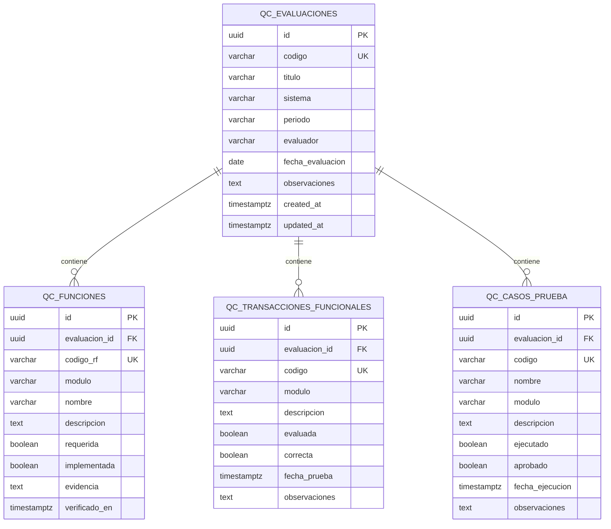

# Modelo Entidad-Relación — Adecuación Funcional (ISO/IEC 25010)

**Sistema:** Gestión de Calzados Calzatura Vilchez  
**Característica:** Adecuación Funcional (Functional Suitability)  
**Subcaracterísticas medidas:** Completitud Funcional, Corrección Funcional, Tasa de Éxito de Casos de Prueba

## Diagrama ER

## Relaciones

| Relación | Cardinalidad | Regla |
|----------|--------------|-------|
| Evaluación → Funciones | 1:N | Cada función pertenece a una evaluación; `codigo_rf` único por evaluación |
| Evaluación → Transacciones | 1:N | Casos de corrección funcional (transacciones de negocio) |
| Evaluación → Casos de prueba | 1:N | Casos ejecutados para TECP |

## Fórmulas (vistas / capa de negocio)

| Indicador | Fórmula ISO | Implementación |
|-----------|-------------|----------------|
| **CF** Completitud Funcional | `(Funciones implementadas / Funciones requeridas) × 100` | `COUNT(implementada=true AND requerida=true) / COUNT(requerida=true)` |
| **COF** Corrección Funcional | `(Transacciones correctas / Transacciones evaluadas) × 100` | `COUNT(correcta=true AND evaluada=true) / COUNT(evaluada=true)` |
| **TECP** Tasa Éxito Casos | `(Casos aprobados / Casos ejecutados) × 100` | `COUNT(aprobado=true AND ejecutado=true) / COUNT(ejecutado=true)` |

## Escala de clasificación

| Rango | Clasificación |
|-------|---------------|
| 90% – 100% | Excelente |
| 80% – 89% | Bueno |
| 70% – 79% | Aceptable |
| &lt; 70% | Deficiente |
